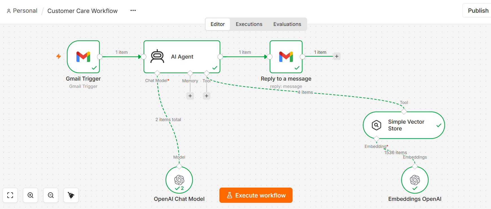
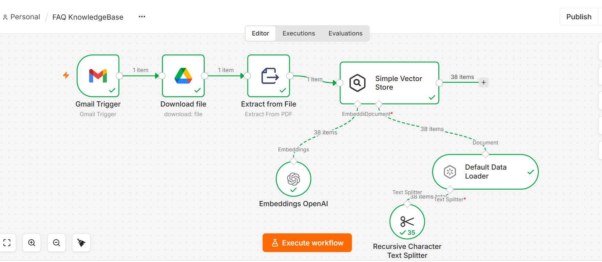

# AI Customer Support Agent — RAG-Powered Email Automation

An AI-powered customer support automation built with **n8n, OpenAI, Gmail, and a vector-based FAQ knowledge base**.

The system automatically reads incoming customer emails, retrieves relevant information from an FAQ knowledge base, generates a grounded response, and replies directly to the original email thread.

## 🎯 Problem

Businesses receive many repetitive customer support questions such as:

- What services do you provide?
- Do I need an appointment?
- Can I cancel or reschedule my appointment?
- What are your business hours?
- What payment methods do you accept?
- How can I contact customer support?

Manually answering these questions takes time and can result in inconsistent responses.

The goal of this project is to automate these repetitive interactions while reducing the risk of the AI inventing business-specific information.

## 💡 Solution

This project uses a **Retrieval-Augmented Generation (RAG)** approach.

Instead of allowing the AI to answer purely from its general knowledge, the customer question is matched against a business FAQ knowledge base.

Relevant information is retrieved and provided to the AI Agent, which uses it to generate the response.

### Workflow

```text
Customer Email
      │
      ▼
 Gmail Trigger
      │
      ▼
   AI Agent
      │
      ▼
FAQ Vector Store
      │
      ▼
Relevant FAQ Information
      │
      ▼
OpenAI Chat Model
      │
      ▼
Generated Response
      │
      ▼
 Gmail Reply
      │
      ▼
Customer
```
### Customer Care Workflow



## 🧠 RAG Knowledge Base
The FAQ knowledge base is provided as a PDF.

The ingestion workflow processes the PDF and converts its content into searchable vector representations.
```
FAQ PDF
   │
   ▼
Google Drive
   │
   ▼
Extract from PDF
   │
   ▼
Document Loader
   │
   ▼
Text Splitter
   │
   ▼
OpenAI Embeddings
   │
   ▼
Vector Store
```

When a customer sends a question, the AI Agent searches the vector store for relevant FAQ information.

### RAG Knowledge Base Workflow



## 🔐 Grounded AI Responses
A major focus of this project is preventing the AI from making up business information.

The AI Agent is instructed to:

Use information from the FAQ knowledge base.
Avoid inventing business policies or details.
Avoid presenting assumptions as business facts.
Ask the customer to contact the business when the FAQ does not contain sufficient information.
Treat placeholders such as [insert timings] or [payment methods] as missing information rather than confirmed facts.

For example, if the FAQ contains:

Our regular business hours are [insert timings].

the AI should not guess the business hours.

This provides a safer approach for customer-support automation.

## 🧪 Example
Customer

Do I need an appointment?

AI Response

Appointments are recommended—especially during busy periods—to ensure prompt service. Walk-ins may be accommodated depending on availability, but booking ahead is the safest option.

The response is generated using relevant information retrieved from the FAQ knowledge base.

Handling Missing Information

If the FAQ contains:

[cash/card/UPI/online payment methods]

the system treats this as incomplete information rather than assuming those payment methods are actually supported.

The AI instead tells the customer that the specific payment information is unavailable and recommends contacting the business.

## 🛠️ Tech Stack

- **n8n** — Workflow automation and AI orchestration
- **OpenAI** — LLM and text embeddings
- **Gmail** — Customer email trigger and automated replies
- **Google Drive** — FAQ document storage
- **Vector Store** — Semantic FAQ retrieval
- **PDF** — Knowledge-base source
- **RAG** — Retrieval-Augmented Generation

## 📁 Project Structure

```text
ai-customer-support-agent/
│
├── customer-care-workflow.json
├── faq-knowledge-base.json
└── README.md
```

### `customer-care-workflow.json`

Contains the main customer-support workflow:

```text
Gmail Trigger
     ↓
AI Agent
     ↓
FAQ Retrieval
     ↓
OpenAI
     ↓
Gmail Reply
```

### `faq-knowledge-base.json`

Contains the workflow responsible for processing the FAQ PDF and inserting its content into the vector store.

## ⚙️ Setup

### 1. Import the workflows into n8n

Import:

```text
customer-care-workflow.json
faq-knowledge-base.json
```

into an n8n instance.

### 2. Configure credentials

Configure your own:

- Gmail credentials
- Google Drive credentials
- OpenAI credentials

Credentials are intentionally not included in this repository.

### 3. Add your business FAQ

Replace the demonstration FAQ with the actual business knowledge base.

Business-specific placeholders should be replaced with verified information such as:

- Business hours
- Payment methods
- Customer-support contact details
- Feedback channels
- Services
- Policies

### 4. Process the FAQ

Run the FAQ knowledge-base workflow so the document is converted into searchable vector data.

### 5. Activate the customer-support workflow

Once configured, incoming customer emails can be automatically processed and answered.

## ⚠️ Current Limitations

The current implementation uses n8n's Simple Vector Store, which is suitable for experimentation and demonstration.

For a production deployment, a persistent vector database could be used instead.

The current FAQ is also a demonstration knowledge base and contains placeholder business information that should be replaced before real-world deployment.

## 🚀 Future Improvements

- Persistent vector database such as PostgreSQL/PGVector, Qdrant, or Pinecone
- WhatsApp customer support
- Website chat integration
- Human escalation for complex queries
- Complaint and refund routing
- Business-hours awareness
- Customer conversation history
- Analytics and support dashboards
- Multi-business / multi-tenant support
- Business-specific configuration stored outside the FAQ
- Automated FAQ document updates

## 🎓 What This Project Demonstrates

This project demonstrates practical implementation of:

- AI Agents
- Retrieval-Augmented Generation (RAG)
- Vector embeddings
- Semantic search
- LLM-based customer support
- Workflow automation
- Gmail integration
- Document ingestion
- AI response grounding
- Basic AI safety and hallucination prevention

## 📌 Project Status

**Working Prototype**

The system has been tested using real Gmail messages and successfully:

1. Received a customer email.
2. Retrieved relevant FAQ information.
3. Generated an AI response.
4. Replied to the original Gmail conversation.
